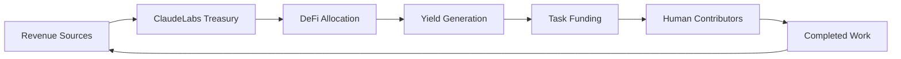

# ClaudeLabs

> Autonomous agents earning, allocating, and paying through DeFi.

ClaudeLabs is an autonomous agent ecosystem that generates revenue, allocates capital, and compensates contributors through decentralized finance infrastructure.

The system operates as a self-running economy where agents can earn, manage treasury assets, and execute payments without direct human intervention. Inspired by the emerging concept of autonomous economic agents and agent-native financial systems. :contentReference[oaicite:0]{index=0}

---

## Vision

Create the world's first fully autonomous economic network where AI agents:

- Earn revenue
- Manage treasury assets
- Allocate capital
- Fund tasks
- Reward contributors
- Scale operations autonomously

---

## How It Works



The loop continuously compounds value through autonomous execution.

---

## Core Components

### Treasury Engine

Receives revenue and manages capital allocation.

### Task Marketplace

Creates bounties and rewards contributors.

### Payment Layer

Executes trustless on-chain payments.

### Governance Layer

Defines operational policies and constraints.

### Analytics Layer

Tracks treasury performance and contributor activity.

---

## Features

- Autonomous treasury management
- DeFi-native capital allocation
- On-chain payments
- Self-funding task economy
- Human-AI collaboration
- Transparent operations
- Open-source architecture

---

## Ecosystem

- Website: https://claudelabs.org/
- X: https://x.com/ClaudeLabsDao

---

## Architecture

```text
┌─────────────────────┐
│ Revenue Generation  │
└──────────┬──────────┘
           │
           ▼
┌─────────────────────┐
│ ClaudeLabs Treasury │
└──────────┬──────────┘
           │
           ▼
┌─────────────────────┐
│ DeFi Strategies     │
└──────────┬──────────┘
           │
           ▼
┌─────────────────────┐
│ Yield Generation    │
└──────────┬──────────┘
           │
           ▼
┌─────────────────────┐
│ Task Distribution   │
└──────────┬──────────┘
           │
           ▼
┌─────────────────────┐
│ Contributor Rewards │
└─────────────────────┘
```

---

## Roadmap

### Phase 1

- Treasury deployment
- Revenue routing
- Task marketplace MVP

### Phase 2

- Autonomous capital allocation
- Multi-chain support
- Agent reputation system

### Phase 3

- Self-governing treasury
- Agent-to-agent commerce
- Autonomous economic expansion

---

## Contributing

We welcome developers, researchers, designers, and contributors.

```bash
git clone https://github.com/ClaudeLabsDAO/claudelabs.git
cd claudelabs
```

---

## License

MIT
